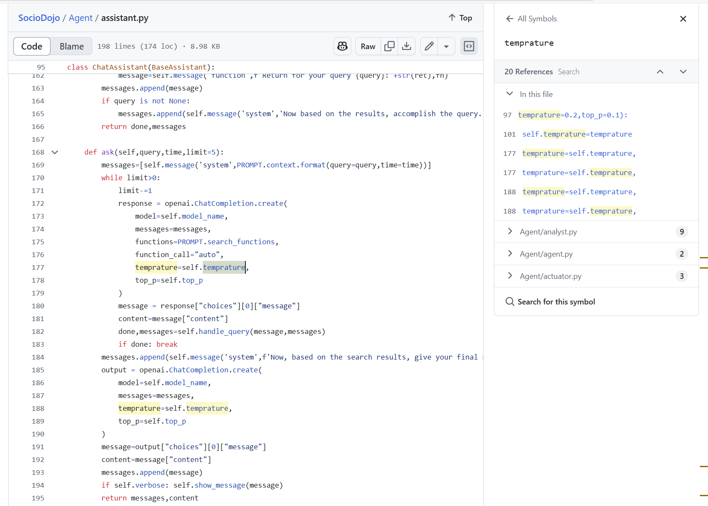
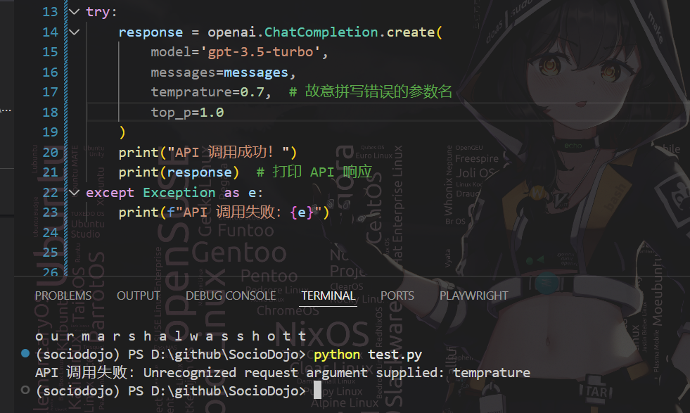

# 日报 
## 20250313~20250314 20250316~20250317
调老师要求要复现的论文代码，成堆的bug，感觉写代码的人很有恶意（恼）。
甚至把temperature拼成temprature，这样写openaiAPI根本是拉不到数据的！
这论文是怎么整出来的？？？？
代码证据： from github

实验结果：

## 20250315
休息。
## 20250317~20250319
在4090上跑知识库嵌入模型，但是目前显卡占用比较高，跑的很慢很慢……

# 其他
写了个社团网站demo，浅度学习了一下vue、网站搭建、github action之类的东西。
感觉这种什么正事都没干，接下来不管这个Sociodojo到底是怎么回事，我还是先读点论文先吧……
这代码真的没法复用我真的想全砍了重写啊。

