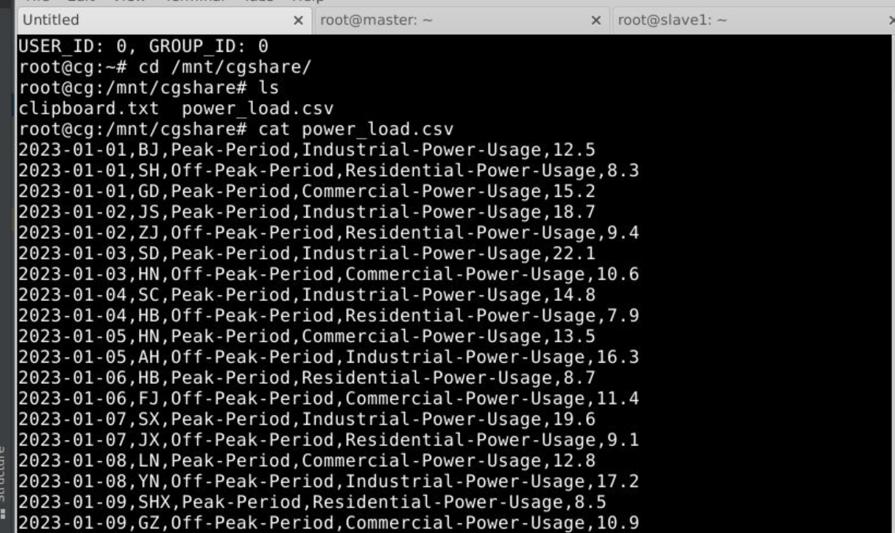

## 作业
将csv文件导入希冀平台
更多-上传文件至远程桌面


首先将数据上传到hadoop服务器


这里，建议先根据希冀平台的教程跑通 WordCount 项目。注意 Hadoop MapReduce 作业要求输出目录不能预先存在，以防止数据覆盖或丢失。[deepseek chat](https://chat.deepseek.com/share/ml9s9z8um3n8wcc1l7)

使用cat命令查看文件存储格式
观察到使用换行分割一组数据，逗号分隔一项数据


作业代码
```java
import java.io.IOException;
import java.time.LocalDate;

import org.apache.commons.lang.StringUtils;
import org.apache.hadoop.io.DoubleWritable;
import org.apache.hadoop.io.LongWritable;
import org.apache.hadoop.io.Text;
import org.apache.hadoop.mapreduce.Mapper;
public class WcMap extends Mapper<LongWritable, Text, Text, DoubleWritable>{
    @Override
    protected void map(LongWritable key, Text value, Context context)
            throws IOException, InterruptedException {
        //1:
        String str = value.toString();
        String[] Data = StringUtils.split(str,"\n");
        for(String data : Data){String[] temp = StringUtils.split(data, ',');
            LocalDate date = LocalDate.parse(temp[0]);
            String province = temp[1];
            String timeP = temp[2];
            String type = temp[3];
            double x = Float.parseFloat(temp[4]);
            if(type.equals("Residential-Power-Usage")){
                context.write(new Text("cnt"), new DoubleWritable(1));
                String y_m = temp[0].substring(0, 7);
                context.write(new Text(y_m), new DoubleWritable(x));
            }
            if(type.equals("Industrial-Power-Usage") && temp[0].substring(0, 4).equals("2023")) {
                context.write(new Text("2023 industrial"), new DoubleWritable(x));
            }
            context.write(new Text(province), new DoubleWritable(x));
        }
    }
}

// /hw/power_load.csv
// /hw/result/

// /mapreduce/WordCount/input
// /mapreduce/WordCount/output
```


```java
import java.io.IOException;
import org.apache.hadoop.io.DoubleWritable;
import org.apache.hadoop.io.Text;
import org.apache.hadoop.mapreduce.Reducer;
public class WcReduce extends Reducer<Text, DoubleWritable, Text, DoubleWritable>{
    @Override
    protected void reduce(Text key, Iterable<DoubleWritable> values,Context context)
            throws IOException, InterruptedException {
        double result = 0;

        if(key.getLength() == 2){
            for(DoubleWritable value : values) {
                result = Math.max(result, value.get());
            }
        }
        else{
            for(DoubleWritable value : values){
                result += value.get();
            }
        }

        context.write(key, new DoubleWritable(result));
    }
}
```

```java
import java.io.IOException;
import org.apache.hadoop.conf.Configuration;
import org.apache.hadoop.fs.Path;
import org.apache.hadoop.io.DoubleWritable;
import org.apache.hadoop.io.Text;
import org.apache.hadoop.mapreduce.Job;
import org.apache.hadoop.mapreduce.lib.input.FileInputFormat;
import org.apache.hadoop.mapreduce.lib.output.FileOutputFormat;
import java.util.Scanner;
import org.apache.hadoop.fs.FSDataInputStream;
import org.apache.hadoop.fs.FileSystem;
import java.net.URI;
public class WcRunner{
    public static void main(String[] args) throws IOException, ClassNotFoundException, InterruptedException {
        Configuration conf = new Configuration();
        Job job = Job.getInstance(conf);

        job.setJarByClass(WcRunner.class);

        job.setMapperClass(WcMap.class);
        job.setReducerClass(WcReduce.class);

        job.setOutputKeyClass(Text.class);
        job.setOutputValueClass(DoubleWritable.class);


        job.setMapOutputKeyClass(Text.class);
        job.setMapOutputValueClass(DoubleWritable.class);

        Scanner sc = new Scanner(System.in);
        System.out.print("inputPath:");
        String inputPath = sc.next();
        System.out.print("outputPath:");
        String outputPath = sc.next();

        FileInputFormat.setInputPaths(job, new Path("hdfs://master:9000"+inputPath));

        FileOutputFormat.setOutputPath(job, new Path("hdfs://master:9000"+outputPath));

        job.waitForCompletion(true);


        try {
            FileSystem fs = FileSystem.get(new URI("hdfs://master:9000"), new Configuration());
            Path srcPath = new Path(outputPath+"/part-r-00000");

            FSDataInputStream is = fs.open(srcPath);
            System.out.println("Results:");
            while(true) {
                String line = is.readLine();
                if(line == null) {
                    break;
                }
                System.out.println(line);
            }
            is.close();
        }catch(Exception e) {
            e.printStackTrace();
        }
    }
}
```

我的结果日志：

```
/opt/module/jdk1.8.0_171/bin/java -javaagent:/usr/local/idea/lib/idea_rt.jar=46797:/usr/local/idea/bin -Dfile.encoding=UTF-8 -classpath /opt/module/jdk1.8.0_171/jre/lib/charsets.jar:/opt/module/jdk1.8.0_171/jre/lib/deploy.jar:/opt/module/jdk1.8.0_171/jre/lib/ext/cldrdata.jar:/opt/module/jdk1.8.0_171/jre/lib/ext/dnsns.jar:/opt/module/jdk1.8.0_171/jre/lib/ext/jaccess.jar:/opt/module/jdk1.8.0_171/jre/lib/ext/jfxrt.jar:/opt/module/jdk1.8.0_171/jre/lib/ext/localedata.jar:/opt/module/jdk1.8.0_171/jre/lib/ext/nashorn.jar:/opt/module/jdk1.8.0_171/jre/lib/ext/sunec.jar:/opt/module/jdk1.8.0_171/jre/lib/ext/sunjce_provider.jar:/opt/module/jdk1.8.0_171/jre/lib/ext/sunpkcs11.jar:/opt/module/jdk1.8.0_171/jre/lib/ext/zipfs.jar:/opt/module/jdk1.8.0_171/jre/lib/javaws.jar:/opt/module/jdk1.8.0_171/jre/lib/jce.jar:/opt/module/jdk1.8.0_171/jre/lib/jfr.jar:/opt/module/jdk1.8.0_171/jre/lib/jfxswt.jar:/opt/module/jdk1.8.0_171/jre/lib/jsse.jar:/opt/module/jdk1.8.0_171/jre/lib/management-agent.jar:/opt/module/jdk1.8.0_171/jre/lib/plugin.jar:/opt/module/jdk1.8.0_171/jre/lib/resources.jar:/opt/module/jdk1.8.0_171/jre/lib/rt.jar:/headless/Desktop/workspace/mapreduce/target/classes:/opt/module/hadoop-2.7.1/share/hadoop/common/hadoop-nfs-2.7.1.jar:/opt/module/hadoop-2.7.1/share/hadoop/common/hadoop-common-2.7.1.jar:/opt/module/hadoop-2.7.1/share/hadoop/common/hadoop-common-2.7.1-tests.jar:/opt/module/hadoop-2.7.1/share/hadoop/hdfs/hadoop-hdfs-2.7.1.jar:/opt/module/hadoop-2.7.1/share/hadoop/hdfs/hadoop-hdfs-nfs-2.7.1.jar:/opt/module/hadoop-2.7.1/share/hadoop/hdfs/hadoop-hdfs-2.7.1-tests.jar:/opt/module/hadoop-2.7.1/share/hadoop/httpfs:/opt/module/hadoop-2.7.1/share/hadoop/kms:/opt/module/hadoop-2.7.1/share/hadoop/mapreduce/hadoop-mapreduce-examples-2.7.1.jar:/opt/module/hadoop-2.7.1/share/hadoop/mapreduce/hadoop-mapreduce-client-hs-2.7.1.jar:/opt/module/hadoop-2.7.1/share/hadoop/mapreduce/hadoop-mapreduce-client-app-2.7.1.jar:/opt/module/hadoop-2.7.1/share/hadoop/mapreduce/hadoop-mapreduce-client-core-2.7.1.jar:/opt/module/hadoop-2.7.1/share/hadoop/mapreduce/hadoop-mapreduce-client-common-2.7.1.jar:/opt/module/hadoop-2.7.1/share/hadoop/mapreduce/hadoop-mapreduce-client-shuffle-2.7.1.jar:/opt/module/hadoop-2.7.1/share/hadoop/mapreduce/hadoop-mapreduce-client-jobclient-2.7.1.jar:/opt/module/hadoop-2.7.1/share/hadoop/mapreduce/hadoop-mapreduce-client-hs-plugins-2.7.1.jar:/opt/module/hadoop-2.7.1/share/hadoop/mapreduce/hadoop-mapreduce-client-jobclient-2.7.1-tests.jar:/opt/module/hadoop-2.7.1/share/hadoop/tools:/opt/module/hadoop-2.7.1/share/hadoop/yarn/hadoop-yarn-api-2.7.1.jar:/opt/module/hadoop-2.7.1/share/hadoop/yarn/hadoop-yarn-client-2.7.1.jar:/opt/module/hadoop-2.7.1/share/hadoop/yarn/hadoop-yarn-common-2.7.1.jar:/opt/module/hadoop-2.7.1/share/hadoop/yarn/hadoop-yarn-registry-2.7.1.jar:/opt/module/hadoop-2.7.1/share/hadoop/yarn/hadoop-yarn-server-tests-2.7.1.jar:/opt/module/hadoop-2.7.1/share/hadoop/yarn/hadoop-yarn-server-common-2.7.1.jar:/opt/module/hadoop-2.7.1/share/hadoop/yarn/hadoop-yarn-server-web-proxy-2.7.1.jar:/opt/module/hadoop-2.7.1/share/hadoop/yarn/hadoop-yarn-server-nodemanager-2.7.1.jar:/opt/module/hadoop-2.7.1/share/hadoop/yarn/hadoop-yarn-server-resourcemanager-2.7.1.jar:/opt/module/hadoop-2.7.1/share/hadoop/yarn/hadoop-yarn-server-sharedcachemanager-2.7.1.jar:/opt/module/hadoop-2.7.1/share/hadoop/yarn/hadoop-yarn-applications-distributedshell-2.7.1.jar:/opt/module/hadoop-2.7.1/share/hadoop/yarn/hadoop-yarn-server-applicationhistoryservice-2.7.1.jar:/opt/module/hadoop-2.7.1/share/hadoop/yarn/hadoop-yarn-applications-unmanaged-am-launcher-2.7.1.jar:/opt/module/hadoop-2.7.1/share/hadoop/common/lib/xz-1.0.jar:/opt/module/hadoop-2.7.1/share/hadoop/common/lib/asm-3.2.jar:/opt/module/hadoop-2.7.1/share/hadoop/common/lib/avro-1.7.4.jar:/opt/module/hadoop-2.7.1/share/hadoop/common/lib/gson-2.2.4.jar:/opt/module/hadoop-2.7.1/share/hadoop/common/lib/junit-4.11.jar:/opt/module/hadoop-2.7.1/share/hadoop/common/lib/jsch-0.1.42.jar:/opt/module/hadoop-2.7.1/share/hadoop/common/lib/jsp-api-2.1.jar:/opt/module/hadoop-2.7.1/share/hadoop/common/lib/xmlenc-0.52.jar:/opt/module/hadoop-2.7.1/share/hadoop/common/lib/guava-11.0.2.jar:/opt/module/hadoop-2.7.1/share/hadoop/common/lib/jets3t-0.9.0.jar:/opt/module/hadoop-2.7.1/share/hadoop/common/lib/jettison-1.1.jar:/opt/module/hadoop-2.7.1/share/hadoop/common/lib/jetty-6.1.26.jar:/opt/module/hadoop-2.7.1/share/hadoop/common/lib/jsr305-3.0.0.jar:/opt/module/hadoop-2.7.1/share/hadoop/common/lib/log4j-1.2.17.jar:/opt/module/hadoop-2.7.1/share/hadoop/common/lib/paranamer-2.3.jar:/opt/module/hadoop-2.7.1/share/hadoop/common/lib/activation-1.1.jar:/opt/module/hadoop-2.7.1/share/hadoop/common/lib/commons-io-2.4.jar:/opt/module/hadoop-2.7.1/share/hadoop/common/lib/httpcore-4.2.5.jar:/opt/module/hadoop-2.7.1/share/hadoop/common/lib/jaxb-api-2.2.2.jar:/opt/module/hadoop-2.7.1/share/hadoop/common/lib/stax-api-1.0-2.jar:/opt/module/hadoop-2.7.1/share/hadoop/common/lib/commons-cli-1.2.jar:/opt/module/hadoop-2.7.1/share/hadoop/common/lib/commons-net-3.1.jar:/opt/module/hadoop-2.7.1/share/hadoop/common/lib/jersey-core-1.9.jar:/opt/module/hadoop-2.7.1/share/hadoop/common/lib/jersey-json-1.9.jar:/opt/module/hadoop-2.7.1/share/hadoop/common/lib/servlet-api-2.5.jar:/opt/module/hadoop-2.7.1/share/hadoop/common/lib/zookeeper-3.4.6.jar:/opt/module/hadoop-2.7.1/share/hadoop/common/lib/commons-lang-2.6.jar:/opt/module/hadoop-2.7.1/share/hadoop/common/lib/httpclient-4.2.5.jar:/opt/module/hadoop-2.7.1/share/hadoop/common/lib/slf4j-api-1.7.10.jar:/opt/module/hadoop-2.7.1/share/hadoop/common/lib/commons-codec-1.4.jar:/opt/module/hadoop-2.7.1/share/hadoop/common/lib/hadoop-auth-2.7.1.jar:/opt/module/hadoop-2.7.1/share/hadoop/common/lib/hamcrest-core-1.3.jar:/opt/module/hadoop-2.7.1/share/hadoop/common/lib/jackson-xc-1.9.13.jar:/opt/module/hadoop-2.7.1/share/hadoop/common/lib/jaxb-impl-2.2.3-1.jar:/opt/module/hadoop-2.7.1/share/hadoop/common/lib/jersey-server-1.9.jar:/opt/module/hadoop-2.7.1/share/hadoop/common/lib/jetty-util-6.1.26.jar:/opt/module/hadoop-2.7.1/share/hadoop/common/lib/mockito-all-1.8.5.jar:/opt/module/hadoop-2.7.1/share/hadoop/common/lib/netty-3.6.2.Final.jar:/opt/module/hadoop-2.7.1/share/hadoop/common/lib/api-util-1.0.0-M20.jar:/opt/module/hadoop-2.7.1/share/hadoop/common/lib/commons-math3-3.1.1.jar:/opt/module/hadoop-2.7.1/share/hadoop/common/lib/java-xmlbuilder-0.4.jar:/opt/module/hadoop-2.7.1/share/hadoop/common/lib/protobuf-java-2.5.0.jar:/opt/module/hadoop-2.7.1/share/hadoop/common/lib/snappy-java-1.0.4.1.jar:/opt/module/hadoop-2.7.1/share/hadoop/common/lib/commons-digester-1.8.jar:/opt/module/hadoop-2.7.1/share/hadoop/common/lib/curator-client-2.7.1.jar:/opt/module/hadoop-2.7.1/share/hadoop/common/lib/jackson-jaxrs-1.9.13.jar:/opt/module/hadoop-2.7.1/share/hadoop/common/lib/slf4j-log4j12-1.7.10.jar:/opt/module/hadoop-2.7.1/share/hadoop/common/lib/commons-logging-1.1.3.jar:/opt/module/hadoop-2.7.1/share/hadoop/common/lib/curator-recipes-2.7.1.jar:/opt/module/hadoop-2.7.1/share/hadoop/common/lib/api-asn1-api-1.0.0-M20.jar:/opt/module/hadoop-2.7.1/share/hadoop/common/lib/commons-compress-1.4.1.jar:/opt/module/hadoop-2.7.1/share/hadoop/common/lib/commons-httpclient-3.1.jar:/opt/module/hadoop-2.7.1/share/hadoop/common/lib/apacheds-i18n-2.0.0-M15.jar:/opt/module/hadoop-2.7.1/share/hadoop/common/lib/commons-beanutils-1.7.0.jar:/opt/module/hadoop-2.7.1/share/hadoop/common/lib/curator-framework-2.7.1.jar:/opt/module/hadoop-2.7.1/share/hadoop/common/lib/jackson-core-asl-1.9.13.jar:/opt/module/hadoop-2.7.1/share/hadoop/common/lib/hadoop-annotations-2.7.1.jar:/opt/module/hadoop-2.7.1/share/hadoop/common/lib/commons-collections-3.2.1.jar:/opt/module/hadoop-2.7.1/share/hadoop/common/lib/commons-configuration-1.6.jar:/opt/module/hadoop-2.7.1/share/hadoop/common/lib/jackson-mapper-asl-1.9.13.jar:/opt/module/hadoop-2.7.1/share/hadoop/common/lib/commons-beanutils-core-1.8.0.jar:/opt/module/hadoop-2.7.1/share/hadoop/common/lib/htrace-core-3.1.0-incubating.jar:/opt/module/hadoop-2.7.1/share/hadoop/common/lib/apacheds-kerberos-codec-2.0.0-M15.jar WcRunner
2025-10-24 03:56:24,511 WARN  [main] util.NativeCodeLoader (NativeCodeLoader.java:<clinit>(62)) - Unable to load native-hadoop library for your platform... using builtin-java classes where applicable
inputPath:/hw/power_load.csv
outputPath:/hw/result/
2025-10-24 03:56:32,605 INFO  [main] Configuration.deprecation (Configuration.java:warnOnceIfDeprecated(1173)) - session.id is deprecated. Instead, use dfs.metrics.session-id
2025-10-24 03:56:32,606 INFO  [main] jvm.JvmMetrics (JvmMetrics.java:init(76)) - Initializing JVM Metrics with processName=JobTracker, sessionId=
2025-10-24 03:56:32,932 WARN  [main] mapreduce.JobResourceUploader (JobResourceUploader.java:uploadFiles(64)) - Hadoop command-line option parsing not performed. Implement the Tool interface and execute your application with ToolRunner to remedy this.
2025-10-24 03:56:32,938 WARN  [main] mapreduce.JobResourceUploader (JobResourceUploader.java:uploadFiles(171)) - No job jar file set.  User classes may not be found. See Job or Job#setJar(String).
2025-10-24 03:56:32,970 INFO  [main] input.FileInputFormat (FileInputFormat.java:listStatus(283)) - Total input paths to process : 1
2025-10-24 03:56:33,165 INFO  [main] mapreduce.JobSubmitter (JobSubmitter.java:submitJobInternal(198)) - number of splits:1
2025-10-24 03:56:33,267 INFO  [main] mapreduce.JobSubmitter (JobSubmitter.java:printTokens(287)) - Submitting tokens for job: job_local2126170186_0001
2025-10-24 03:56:33,411 INFO  [main] mapreduce.Job (Job.java:submit(1294)) - The url to track the job: http://localhost:8080/
2025-10-24 03:56:33,412 INFO  [main] mapreduce.Job (Job.java:monitorAndPrintJob(1339)) - Running job: job_local2126170186_0001
2025-10-24 03:56:33,416 INFO  [Thread-15] mapred.LocalJobRunner (LocalJobRunner.java:createOutputCommitter(471)) - OutputCommitter set in config null
2025-10-24 03:56:33,424 INFO  [Thread-15] output.FileOutputCommitter (FileOutputCommitter.java:<init>(100)) - File Output Committer Algorithm version is 1
2025-10-24 03:56:33,427 INFO  [Thread-15] mapred.LocalJobRunner (LocalJobRunner.java:createOutputCommitter(489)) - OutputCommitter is org.apache.hadoop.mapreduce.lib.output.FileOutputCommitter
2025-10-24 03:56:33,499 INFO  [Thread-15] mapred.LocalJobRunner (LocalJobRunner.java:runTasks(448)) - Waiting for map tasks
2025-10-24 03:56:33,501 INFO  [LocalJobRunner Map Task Executor #0] mapred.LocalJobRunner (LocalJobRunner.java:run(224)) - Starting task: attempt_local2126170186_0001_m_000000_0
2025-10-24 03:56:33,528 INFO  [LocalJobRunner Map Task Executor #0] output.FileOutputCommitter (FileOutputCommitter.java:<init>(100)) - File Output Committer Algorithm version is 1
2025-10-24 03:56:33,546 INFO  [LocalJobRunner Map Task Executor #0] mapred.Task (Task.java:initialize(612)) -  Using ResourceCalculatorProcessTree : [ ]
2025-10-24 03:56:33,552 INFO  [LocalJobRunner Map Task Executor #0] mapred.MapTask (MapTask.java:runNewMapper(756)) - Processing split: hdfs://master:9000/hw/power_load.csv:0+36063
2025-10-24 03:56:33,599 INFO  [LocalJobRunner Map Task Executor #0] mapred.MapTask (MapTask.java:setEquator(1205)) - (EQUATOR) 0 kvi 26214396(104857584)
2025-10-24 03:56:33,599 INFO  [LocalJobRunner Map Task Executor #0] mapred.MapTask (MapTask.java:init(998)) - mapreduce.task.io.sort.mb: 100
2025-10-24 03:56:33,599 INFO  [LocalJobRunner Map Task Executor #0] mapred.MapTask (MapTask.java:init(999)) - soft limit at 83886080
2025-10-24 03:56:33,599 INFO  [LocalJobRunner Map Task Executor #0] mapred.MapTask (MapTask.java:init(1000)) - bufstart = 0; bufvoid = 104857600
2025-10-24 03:56:33,599 INFO  [LocalJobRunner Map Task Executor #0] mapred.MapTask (MapTask.java:init(1001)) - kvstart = 26214396; length = 6553600
2025-10-24 03:56:33,603 INFO  [LocalJobRunner Map Task Executor #0] mapred.MapTask (MapTask.java:createSortingCollector(403)) - Map output collector class = org.apache.hadoop.mapred.MapTask$MapOutputBuffer
2025-10-24 03:56:33,789 INFO  [LocalJobRunner Map Task Executor #0] mapred.LocalJobRunner (LocalJobRunner.java:statusUpdate(591)) - 
2025-10-24 03:56:33,792 INFO  [LocalJobRunner Map Task Executor #0] mapred.MapTask (MapTask.java:flush(1460)) - Starting flush of map output
2025-10-24 03:56:33,792 INFO  [LocalJobRunner Map Task Executor #0] mapred.MapTask (MapTask.java:flush(1482)) - Spilling map output
2025-10-24 03:56:33,793 INFO  [LocalJobRunner Map Task Executor #0] mapred.MapTask (MapTask.java:flush(1483)) - bufstart = 0; bufend = 18003; bufvoid = 104857600
2025-10-24 03:56:33,793 INFO  [LocalJobRunner Map Task Executor #0] mapred.MapTask (MapTask.java:flush(1485)) - kvstart = 26214396(104857584); kvend = 26209352(104837408); length = 5045/6553600
2025-10-24 03:56:33,811 INFO  [LocalJobRunner Map Task Executor #0] mapred.MapTask (MapTask.java:sortAndSpill(1667)) - Finished spill 0
2025-10-24 03:56:33,815 INFO  [LocalJobRunner Map Task Executor #0] mapred.Task (Task.java:done(1038)) - Task:attempt_local2126170186_0001_m_000000_0 is done. And is in the process of committing
2025-10-24 03:56:33,826 INFO  [LocalJobRunner Map Task Executor #0] mapred.LocalJobRunner (LocalJobRunner.java:statusUpdate(591)) - map
2025-10-24 03:56:33,827 INFO  [LocalJobRunner Map Task Executor #0] mapred.Task (Task.java:sendDone(1158)) - Task 'attempt_local2126170186_0001_m_000000_0' done.
2025-10-24 03:56:33,827 INFO  [LocalJobRunner Map Task Executor #0] mapred.LocalJobRunner (LocalJobRunner.java:run(249)) - Finishing task: attempt_local2126170186_0001_m_000000_0
2025-10-24 03:56:33,828 INFO  [Thread-15] mapred.LocalJobRunner (LocalJobRunner.java:runTasks(456)) - map task executor complete.
2025-10-24 03:56:33,833 INFO  [Thread-15] mapred.LocalJobRunner (LocalJobRunner.java:runTasks(448)) - Waiting for reduce tasks
2025-10-24 03:56:33,833 INFO  [pool-6-thread-1] mapred.LocalJobRunner (LocalJobRunner.java:run(302)) - Starting task: attempt_local2126170186_0001_r_000000_0
2025-10-24 03:56:33,844 INFO  [pool-6-thread-1] output.FileOutputCommitter (FileOutputCommitter.java:<init>(100)) - File Output Committer Algorithm version is 1
2025-10-24 03:56:33,845 INFO  [pool-6-thread-1] mapred.Task (Task.java:initialize(612)) -  Using ResourceCalculatorProcessTree : [ ]
2025-10-24 03:56:33,848 INFO  [pool-6-thread-1] mapred.ReduceTask (ReduceTask.java:run(362)) - Using ShuffleConsumerPlugin: org.apache.hadoop.mapreduce.task.reduce.Shuffle@4a8f1c82
2025-10-24 03:56:33,860 INFO  [pool-6-thread-1] reduce.MergeManagerImpl (MergeManagerImpl.java:<init>(196)) - MergerManager: memoryLimit=1503238528, maxSingleShuffleLimit=375809632, mergeThreshold=992137472, ioSortFactor=10, memToMemMergeOutputsThreshold=10
2025-10-24 03:56:33,863 INFO  [EventFetcher for fetching Map Completion Events] reduce.EventFetcher (EventFetcher.java:run(61)) - attempt_local2126170186_0001_r_000000_0 Thread started: EventFetcher for fetching Map Completion Events
2025-10-24 03:56:33,898 INFO  [localfetcher#1] reduce.LocalFetcher (LocalFetcher.java:copyMapOutput(144)) - localfetcher#1 about to shuffle output of map attempt_local2126170186_0001_m_000000_0 decomp: 20529 len: 20533 to MEMORY
2025-10-24 03:56:33,901 INFO  [localfetcher#1] reduce.InMemoryMapOutput (InMemoryMapOutput.java:shuffle(100)) - Read 20529 bytes from map-output for attempt_local2126170186_0001_m_000000_0
2025-10-24 03:56:33,903 INFO  [localfetcher#1] reduce.MergeManagerImpl (MergeManagerImpl.java:closeInMemoryFile(314)) - closeInMemoryFile -> map-output of size: 20529, inMemoryMapOutputs.size() -> 1, commitMemory -> 0, usedMemory ->20529
2025-10-24 03:56:33,904 INFO  [EventFetcher for fetching Map Completion Events] reduce.EventFetcher (EventFetcher.java:run(76)) - EventFetcher is interrupted.. Returning
2025-10-24 03:56:33,906 INFO  [pool-6-thread-1] mapred.LocalJobRunner (LocalJobRunner.java:statusUpdate(591)) - 1 / 1 copied.
2025-10-24 03:56:33,906 INFO  [pool-6-thread-1] reduce.MergeManagerImpl (MergeManagerImpl.java:finalMerge(674)) - finalMerge called with 1 in-memory map-outputs and 0 on-disk map-outputs
2025-10-24 03:56:33,913 INFO  [pool-6-thread-1] mapred.Merger (Merger.java:merge(606)) - Merging 1 sorted segments
2025-10-24 03:56:33,914 INFO  [pool-6-thread-1] mapred.Merger (Merger.java:merge(705)) - Down to the last merge-pass, with 1 segments left of total size: 20511 bytes
2025-10-24 03:56:33,920 INFO  [pool-6-thread-1] reduce.MergeManagerImpl (MergeManagerImpl.java:finalMerge(751)) - Merged 1 segments, 20529 bytes to disk to satisfy reduce memory limit
2025-10-24 03:56:33,921 INFO  [pool-6-thread-1] reduce.MergeManagerImpl (MergeManagerImpl.java:finalMerge(781)) - Merging 1 files, 20533 bytes from disk
2025-10-24 03:56:33,922 INFO  [pool-6-thread-1] reduce.MergeManagerImpl (MergeManagerImpl.java:finalMerge(796)) - Merging 0 segments, 0 bytes from memory into reduce
2025-10-24 03:56:33,922 INFO  [pool-6-thread-1] mapred.Merger (Merger.java:merge(606)) - Merging 1 sorted segments
2025-10-24 03:56:33,923 INFO  [pool-6-thread-1] mapred.Merger (Merger.java:merge(705)) - Down to the last merge-pass, with 1 segments left of total size: 20511 bytes
2025-10-24 03:56:33,924 INFO  [pool-6-thread-1] mapred.LocalJobRunner (LocalJobRunner.java:statusUpdate(591)) - 1 / 1 copied.
2025-10-24 03:56:33,969 INFO  [pool-6-thread-1] Configuration.deprecation (Configuration.java:warnOnceIfDeprecated(1173)) - mapred.skip.on is deprecated. Instead, use mapreduce.job.skiprecords
2025-10-24 03:56:34,415 INFO  [main] mapreduce.Job (Job.java:monitorAndPrintJob(1360)) - Job job_local2126170186_0001 running in uber mode : false
2025-10-24 03:56:34,418 INFO  [main] mapreduce.Job (Job.java:monitorAndPrintJob(1367)) -  map 100% reduce 0%
2025-10-24 03:56:34,770 INFO  [pool-6-thread-1] mapred.Task (Task.java:done(1038)) - Task:attempt_local2126170186_0001_r_000000_0 is done. And is in the process of committing
2025-10-24 03:56:34,776 INFO  [pool-6-thread-1] mapred.LocalJobRunner (LocalJobRunner.java:statusUpdate(591)) - 1 / 1 copied.
2025-10-24 03:56:34,776 INFO  [pool-6-thread-1] mapred.Task (Task.java:commit(1199)) - Task attempt_local2126170186_0001_r_000000_0 is allowed to commit now
2025-10-24 03:56:34,817 INFO  [pool-6-thread-1] output.FileOutputCommitter (FileOutputCommitter.java:commitTask(482)) - Saved output of task 'attempt_local2126170186_0001_r_000000_0' to hdfs://master:9000/hw/result/_temporary/0/task_local2126170186_0001_r_000000
2025-10-24 03:56:34,819 INFO  [pool-6-thread-1] mapred.LocalJobRunner (LocalJobRunner.java:statusUpdate(591)) - reduce > reduce
2025-10-24 03:56:34,820 INFO  [pool-6-thread-1] mapred.Task (Task.java:sendDone(1158)) - Task 'attempt_local2126170186_0001_r_000000_0' done.
2025-10-24 03:56:34,820 INFO  [pool-6-thread-1] mapred.LocalJobRunner (LocalJobRunner.java:run(325)) - Finishing task: attempt_local2126170186_0001_r_000000_0
2025-10-24 03:56:34,820 INFO  [Thread-15] mapred.LocalJobRunner (LocalJobRunner.java:runTasks(456)) - reduce task executor complete.
2025-10-24 03:56:35,420 INFO  [main] mapreduce.Job (Job.java:monitorAndPrintJob(1367)) -  map 100% reduce 100%
2025-10-24 03:56:35,421 INFO  [main] mapreduce.Job (Job.java:monitorAndPrintJob(1378)) - Job job_local2126170186_0001 completed successfully
2025-10-24 03:56:35,436 INFO  [main] mapreduce.Job (Job.java:monitorAndPrintJob(1385)) - Counters: 35
	File System Counters
		FILE: Number of bytes read=41434
		FILE: Number of bytes written=607543
		FILE: Number of read operations=0
		FILE: Number of large read operations=0
		FILE: Number of write operations=0
		HDFS: Number of bytes read=72126
		HDFS: Number of bytes written=887
		HDFS: Number of read operations=13
		HDFS: Number of large read operations=0
		HDFS: Number of write operations=4
	Map-Reduce Framework
		Map input records=631
		Map output records=1262
		Map output bytes=18003
		Map output materialized bytes=20533
		Input split bytes=101
		Combine input records=0
		Combine output records=0
		Reduce input groups=43
		Reduce shuffle bytes=20533
		Reduce input records=1262
		Reduce output records=43
		Spilled Records=2524
		Shuffled Maps =1
		Failed Shuffles=0
		Merged Map outputs=1
		GC time elapsed (ms)=15
		Total committed heap usage (bytes)=553648128
	Shuffle Errors
		BAD_ID=0
		CONNECTION=0
		IO_ERROR=0
		WRONG_LENGTH=0
		WRONG_MAP=0
		WRONG_REDUCE=0
	File Input Format Counters 
		Bytes Read=36063
	File Output Format Counters 
		Bytes Written=887
Results:
2023 industrial	4165.299994468689
2023-01	170.90000009536743
2023-02	134.80000066757202
2023-03	164.59999895095825
2023-04	167.20000076293945
2023-05	169.5
2023-06	162.70000076293945
2023-07	159.5
2023-08	168.80000019073486
2023-09	172.00000095367432
2023-10	168.80000019073486
2023-11	160.0
2023-12	53.0
AH	21.200000762939453
BJ	21.0
CQ	21.100000381469727
FJ	20.899999618530273
GD	20.799999237060547
GS	21.399999618530273
GXI	298.89999866485596
GZ	21.399999618530273
HAIN	275.3999996185303
HB	21.299999237060547
HLJ	268.50000286102295
HN	21.5
JL	21.299999237060547
JS	21.299999237060547
JX	20.700000762939453
LN	19.799999237060547
NMG	269.50000190734863
NX	21.100000381469727
QH	20.5
SC	20.899999618530273
SD	22.100000381469727
SH	21.0
SHX	256.2999954223633
SX	19.700000762939453
TJ	20.5
XJ	21.399999618530273
XZ	20.899999618530273
YN	20.799999237060547
ZJ	20.700000762939453
cnt	210.0

Process finished with exit code 0

```